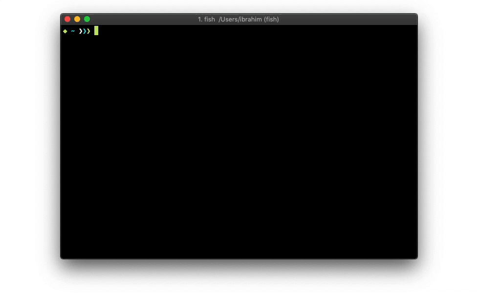

  

# tldr++
community driven man pages improved with smart user interaction. tldr++ seperates itself with convenient user guidance and accelerates command generating.

## Features
- Interactive (see the screencast)
- Smart file suggestions (further suggestions will be added)
- Simple implementation
- One of the fastest clients can be benchmarked with static option
- Multi-Platform
- *Pure-go (even git itself)*

## Installation
Refer to [Release Page](https://github.com/isacikgoz/tldr/releases)

## Credits
- [tldr-pages](https://github.com/tldr-pages/tldr)
- [survey](https://github.com/AlecAivazis/survey)
- [go-prompt](https://github.com/c-bata/go-prompt)
- [go-git](https://github.com/src-d/go-git)
- [kingpin](https://github.com/alecthomas/kingpin)