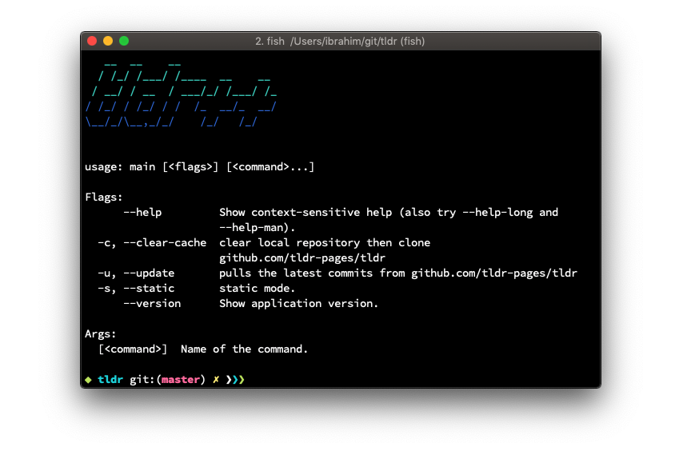

[](https://travis-ci.com/isacikgoz/tldr) [](/LICENSE) 

# tldr++
Community driven man pages improved with smart user interaction. **tldr++** seperates itself from any other tldr client with convenient user guidance feature.



## Features
- Interactive (see the screencast)
- Smart file suggestions (further suggestions will be added)
- Simple implementation
- One of the fastest clients (can be benchmarked with static option)
- Supports all mainstream platforms (Linux, MacOS, Windows)
- Pure-go (*even contains built-in git*)

## Screencast


## Installation

Refer to [Release Page](https://github.com/isacikgoz/tldr/releases) for binaries.

Or, you can build from source: (min. **go 1.10** compiler is recommended)

```bash
go get -u github.com/isacikgoz/tldr
```

## Credits
- [tldr-pages](https://github.com/tldr-pages/tldr)
- [survey](https://github.com/AlecAivazis/survey)
- [go-prompt](https://github.com/c-bata/go-prompt)
- [go-git](https://github.com/src-d/go-git)
- [kingpin](https://github.com/alecthomas/kingpin)
